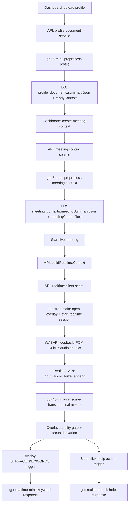

# Audit Mendalam Efisiensi Token Orviko

Tanggal audit: 2026-06-02  
Scope: memahami token flow dan cost hotspot sebelum membuat strategi efisiensi.  
Catatan: audit ini tidak mengubah Excel, code produksi, atau frekuensi keyword request.

## Executive Summary

Biaya utama Orviko ada di live meeting runtime, bukan preprocessing. Berdasarkan simulasi terbaru:

| Komponen | Cost baseline |
|---|---:|
| Live meeting 45 menit | IDR 4,884 |
| User Profile preprocessing | IDR 213 |
| Meeting Context preprocessing | IDR 127 |
| Profile + Meeting Context preprocessing | IDR 340 |

Target pengurangan 15-20% masih mungkin tanpa mengurangi keyword frequency, tetapi area utamanya bukan output trimming. Hotspot terbesar adalah realtime session/static context dan live transcription. Output token hanya sekitar 7.5% dari projected live cost, jadi membatasi output saja tidak cukup.

Temuan paling penting:

- `detailed-example.md` menegaskan behavior wajib: user-triggered, QnA/Convo eksplisit, no fake facts, general meeting framing, keyword transcript-first.
- Realtime session instructions sekitar 30,560 karakter, termasuk static context sekitar 9,982 karakter.
- Static context terbesar adalah structured profile experiences, sekitar 4,036 karakter.
- Average live 8.4 menit menghasilkan 250,980 realtime input tokens, dengan 231,317 cached input tokens.
- Cached input bukan biaya kedua dan bukan output lain. Formula billing yang benar adalah `regular input + cached input discounted + output`.
- Preprocessing sudah terukur dan murah dibanding live runtime, jadi tidak menjadi target utama untuk 15-20%.

## Product Behavior Grounding

Sumber utama: `detailed-example.md`.

Behavior yang wajib dipertahankan sebelum efisiensi token boleh dibahas:

- Orviko tidak menjawab otomatis tanpa trigger user.
- `Jawab Pertanyaan` selalu menghasilkan QnA-style, termasuk implied question tanpa tanda tanya.
- `Tanggapi` selalu menghasilkan Convo-style, walaupun transcript mengandung tanda tanya.
- `Pertanyaan Follow-up` menghasilkan pertanyaan balik yang relevan.
- `Jelaskan Maksudnya` menjelaskan maksud ucapan lawan bicara dan angle respons.
- Keyword chips hanya boleh muncul dari transcript terbaru yang accepted, bukan dari static profile/context saja.
- Output harus singkat, natural, siap diucapkan, dan tidak mengarang fakta.
- Aplikasi harus tetap general meeting assistant, bukan bias interview, B2B, internal, atau domain tertentu.

Anti-pattern yang harus dijaga:

- `Tanggapi` berubah menjadi QnA.
- `Tanggapi` default bertanya balik.
- `Jawab Pertanyaan` memakai meta-intro seperti "Berikut adalah...".
- Output menjadi artikel panjang.
- Profile/context dipaksakan ketika transcript cukup dijawab secara umum.
- Keyword diambil dari static context tanpa evidence transcript.

## End-to-End Token Flow

Model boundaries:

| Flow | Model | Main token surface |
|---|---|---|
| Profile preprocessing | `gpt-5-mini` | PDF inline file + profile prompt |
| Meeting context preprocessing | `gpt-5-mini` | contextName/topic/brief + profile readyContext |
| Live session | `gpt-realtime-mini` | session instructions + static realtimeContext + audio context |
| Live transcription | `gpt-4o-mini-transcribe` | PCM audio + transcription prompt |
| Keyword/help actions | `gpt-realtime-mini` | small trigger prompt + accumulated session context |

## Prompt & Context Inventory

Measurement method: character count from production prompt builders; token estimate uses `ceil(characters / 4)`. This is not a billing token count, but it is useful for hotspot ranking before new simulations.

Active DB context used for measurement:

- Profile: `CV-Donny-Santosa.pdf`
- Meeting context: `PT Global Tiket Network` / `Data Scientist Interview`

Realtime prompt surfaces:

| Prompt/context | Characters | Approx tokens | Notes |
|---|---:|---:|---|
| Realtime session instructions | 30,560 | 7,640 | Includes static context and behavior rules |
| Static context inside session | 9,982 | 2,496 | `formatMeetingContextForPrompt(realtimeContext)` |
| Transcription prompt | 193 | 49 | Small and stable |
| Typical action trigger prompt | 430-465 | 108-117 | Small; not the main hotspot |

Largest static context segments:

| Segment | Characters | Approx tokens | Audit note |
|---|---:|---:|---|
| Structured profile experiences | 4,036 | 1,009 | Largest compacting candidate |
| Domain profile | 1,284 | 321 | Useful for relevance boundary |
| Relevant experience | 747 | 187 | Potentially overlaps with structured experiences |
| Ready context | 455 | 114 | High-value compact profile summary |
| Meeting context text | 442 | 111 | High-value compact meeting summary |
| Useful strengths | 418 | 105 | Useful, but likely action-dependent |
| Profile risks | 389 | 98 | Important for no-fake-claim safety |

Backend non-live prompt estimates:

| Prompt | Model | Characters | Approx tokens | Runtime relevance |
|---|---|---:|---:|---|
| preprocess_profile | `gpt-5-mini` | 3,376 | 845 | Measured, low frequency |
| preprocess_meeting_context | `gpt-5-mini` | 6,889 | 1,723 | Measured, low frequency |
| backend_answer | `gpt-5-mini` | 24,549 | 6,138 | Expensive if used as fallback |
| backend_followup | `gpt-5-mini` | 14,924 | 3,732 | Dev/fallback path |
| backend_explanation | `gpt-5-mini` | 15,020 | 3,756 | Dev/fallback path |
| backend_keyword_help | `gpt-5-mini` | 13,756 | 3,440 | Dev/fallback path |
| backend_surface_keywords | `gpt-5-mini` | 13,141 | 3,286 | Dev/fallback path |

Audit interpretation:

- Live overlay should stay on `gpt-realtime-mini`; backend non-live actions are not the primary runtime but are expensive if accidentally used as production fallback.
- Action prompts themselves are small; the cost is mostly accumulated session context and audio/transcription usage.
- The highest-value context audit target is static realtimeContext formatting, especially structured profile experiences.

## Token Usage Evidence

Sources:

- `Price-Calc/outputs/live-meeting-simulation-20260601-163137`
- `Price-Calc/outputs/live-meeting-simulation-20260601-164219`
- `Price-Calc/outputs/live-meeting-simulation-20260601-165300`
- `Price-Calc/outputs/preprocessing-simulation-20260602-200715`
- `Price-Calc/orviko-pricing-rev.xlsx`

Live meeting measured averages:

| Metric | Average |
|---|---:|
| Reference sample duration | 8.4 minutes |
| 45-minute scale factor | 5.357142857 |
| Help clicks per sample | 7 |
| Keyword requests per sample | 18.7 |
| Transcript turns | 24 |
| Usage records | 48 |
| Transcribe input tokens | 4,075 |
| Transcribe output tokens | 848 |
| Realtime total input tokens | 250,980 |
| Realtime cached input tokens | 231,317 |
| Realtime regular-priced input tokens | 19,663 |
| Realtime output tokens | 1,432 |
| Projected 45-minute cost | IDR 4,884 |
| Observed 45-minute range | IDR 4,492 - 5,330 |

Projected 45-minute cost components:

| Component | IDR | Share |
|---|---:|---:|
| Transcription | 1,764 | 36.1% |
| Realtime regular input | 1,264 | 25.9% |
| Realtime cached input | 1,487 | 30.5% |
| Realtime output | 368 | 7.5% |
| Total | 4,884 | 100.0% |

Preprocessing measured averages:

| Component | Input tokens | Output tokens | Total tokens | Cost |
|---|---:|---:|---:|---:|
| User Profile preprocessing | 2,227 | 5,046 | 7,273 | IDR 213 |
| Meeting Context preprocessing | 1,528 | 2,981 | 4,509 | IDR 127 |
| Profile + Meeting Context | 3,755 | 8,027 | 11,782 | IDR 340 |

Cached token accounting:

- `realtime total input tokens` includes cached tokens.
- `cached input tokens` are a discounted subset of total input tokens.
- Correct formula: `(total input - cached input) * regular rate + cached input * cached rate + output * output rate`.
- Do not add `total input + cached input`; that double-counts cached tokens.

## Hotspot Ranking

1. **Realtime session/static context**

   Evidence: session instructions are about 30,560 characters; static context is about 9,982 characters. Realtime response.done average input is about 250,980 tokens per 8.4-minute sample. Most input becomes cached, but cached input still has cost.

2. **Live transcription**

   Evidence: transcription component is about IDR 1,764 per 45 minutes, or 36.1% of projected live cost. This is large but high-risk because transcript quality drives focus, keywords, and help accuracy.

3. **Full structured profile context**

   Evidence: structured profile experiences alone are about 4,036 characters. This may be more detail than many live actions need.

4. **Backend non-live action prompts**

   Evidence: backend answer prompt estimate is about 24,549 characters. This is not the main live path, but it is expensive if used as fallback or future runtime path.

5. **Realtime output length**

   Evidence: realtime output is about IDR 368 per 45 minutes, only 7.5% of projected live cost. Output budget tuning is useful for latency/readability, but cannot carry the 15-20% target alone.

## Context Duplication & Cacheability Audit

Strengths:

- Realtime session instructions are stable during a session and show high cached-token coverage.
- Action prompts are small and mostly dynamic runtime data.
- Transcription prompt is small.
- Preprocessing cost is measured and relatively low.

Risks:

- Static realtimeContext includes full profile summary, readyContext, relevant background, structured experiences, strengths, risks, meeting summary, criteria, responsibilities, domain profile, and session context for every live session.
- Several profile fields overlap semantically: summary, readyContext, relevantExperience, structured experiences, usefulStrengths.
- Keyword surfacing is correctly transcript-first, but the session still carries broad static context.
- Backend non-live action prompts include full realtimeContext; they should not silently become live fallback.

Cacheability interpretation:

- Current prompt caching appears effective because cached tokens are high.
- However, cached tokens are discounted, not free.
- Therefore, reducing repeated static context can still save cost, but changes must be behavior-safe.

## UX Safety Matrix

| Candidate audit area | Potential impact | Behavior risk | Protect this |
|---|---|---|---|
| Compact static context | High | Medium | No fake profile claims; relevance; no domain bias |
| Action-specific context routing | Medium-high | Medium | Keyword transcript-first; explicit trigger semantics |
| Prompt rule deduplication | Medium | High | QnA/Convo hard guards and anti-pattern protections |
| Output budget tuning | Low | Medium | Ready-to-say usefulness |
| Transcription/audio changes | High | High | Transcript quality, focus derivation, keyword quality |

Important constraint: reducing keyword request frequency is intentionally excluded.

## Candidate Experiment Areas

These are not implementation recommendations yet; they are audit-derived areas worth controlled testing later.

1. **Compact realtimeContext formatting**

   Keep high-signal fields like readyContext, meetingContextText, domain boundary, risks. Measure whether structured experiences can be shortened without losing profile grounding.

2. **Action-specific context profiles**

   Keep keyword actions transcript-first with minimal static background. Keep help actions richer when user/profile evidence is relevant.

3. **Prompt rule deduplication with behavior tests**

   Some realtime instructions repeat similar guards. Any shortening must be tested against `detailed-example.md` acceptance scenarios because these guards protect critical behavior.

4. **Backend non-live fallback guard**

   Audit whether backend `gpt-5-mini` action routes can ever be reached by live UX. If yes, they are cost-heavy and need explicit product intent.

5. **Transcription cost investigation**

   Large potential impact, but high risk. Do not change before measuring transcript quality regressions.

## Validation Answers

- Komponen paling mahal: live meeting runtime.
- Prompt/context paling besar: realtime session instructions and static realtimeContext.
- Token input vs output: live cost dominated by input; output is only about 7.5% of projected live cost.
- Cached token treatment: cached input is a discounted subset of total input, not an additional token bucket to add on top.
- Aman dioptimasi: static context shape and action-specific routing, with behavior tests.
- Tidak aman disentuh langsung: keyword frequency, explicit QnA/Convo behavior, no-auto-answer, no-fake-facts, transcription quality.
- Target 15-20% without keyword frequency reduction: possible, but likely requires compact realtime context plus prompt/cache hygiene; output budget alone is insufficient.

## Assumptions

- Pricing follows current workbook constants, not a fresh external pricing lookup.
- The active DB sample is representative enough for audit hotspot discovery, not final product-wide statistics.
- Existing simulations are trusted evidence; no new simulation was run for this audit.
- Character-based token estimates are directional only; billing token truth comes from API usage events.
