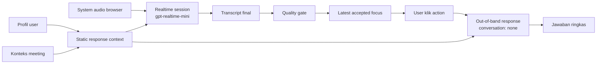

# Arsitektur Konteks Realtime MVP

MVP Web App memisahkan sesi audio/transcription dari konteks response bantuan.

## Flow



## Yang Tidak Menjadi Memori Bantuan

- audio turn lama;
- transcript lama;
- conversation window lokal;
- keyword request lama;
- trigger tombol lama;
- output bantuan sebelumnya.

Riwayat transcript lokal tetap boleh disimpan sebagai rekaman sesi, tetapi tidak dikirim sebagai input response.

## Payload Setiap Klik

```txt
action-specific instructions
+ profil user
+ konteks meeting
+ domain profile
+ action yang dipilih
+ latest accepted focus
+ explicit user text jika ada
```

Ukuran payload percakapan tidak bertambah seiring panjang meeting karena response dibuat dengan custom input dan tidak masuk ke default Conversation.

Instruksi sesi audio sengaja minimal. Instruksi response dipilih per action, sehingga request keyword tidak ikut membawa seluruh aturan QnA/Convo dan request QnA tidak ikut membawa seluruh aturan action lain.

## Rate Limit

Stateless response menghilangkan pertumbuhan token akibat riwayat percakapan. Rate limit tetap mungkin terjadi jika terlalu banyak response dibuat berdekatan, sehingga:

- keyword harus dideduplikasi;
- help mendapat prioritas;
- retry harus terbatas;
- `response.done.usage` dan `rate_limits.updated` harus terlihat di development;
- user tidak boleh diwajibkan menutup panel dan menekan tombol ulang untuk race transcript normal.
